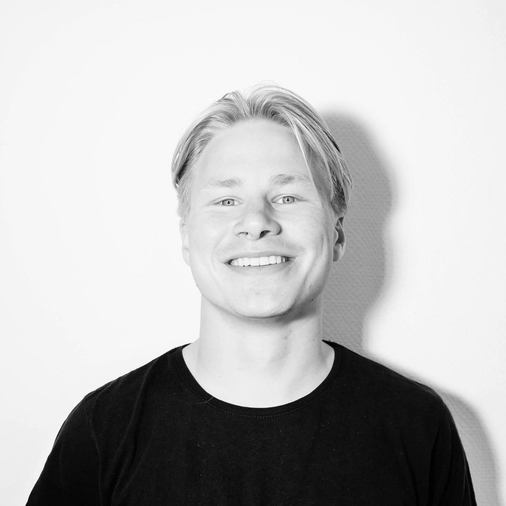
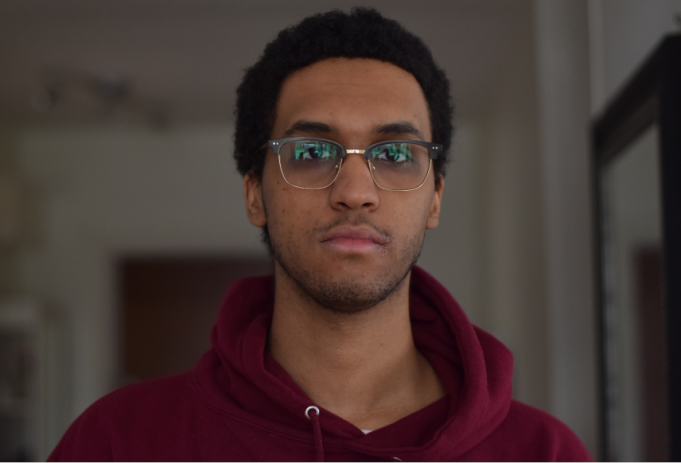
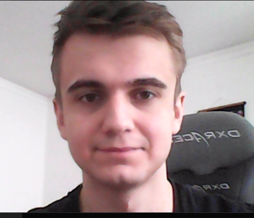

# Medlemmar (Fess)

Projektarbete på kursen Datorsystem med projektarbete (1DT003) 
(1DT096) våren 2020, Uppsala universitet.

**TODO:** Byt ut [PROJEKT] mot det namn ni själva givet projektet.

Grupp: Fess

**INFO:** Detta dokument är skrivet i
formatet
[Markdown](https://help.github.com/articles/getting-started-with-writing-and-formatting-on-github/).

**INFO:** Det går att redigera, förhandsvisa och spara
(commit) [sidan](./gruppkontrakt.md) på GitHub direkt i din webbläsare.

**INFO:** För att lärarna på kursen skall kunna följa och bedöma era
arbetsinsatser är det viktigt att vi vet vem som är vem vid till exempel
muntliga presentationer och andra möten.

**TODO:** Tag foton av alla medlemmar i gruppen. Varje foto skall tydligt visa
 personen framifrån från axlarna och uppåt. Spara bilderna i mappen
 `meta/images/`. Fyll sedan i tabellen nedan. Tabellen skall vara sorterad på
 förnamn. Fältet **Förnamn** skall länka till avsnittet med mer detaljer för
 respektive medlem. I tabellen skall alla bilder ha samma bredd.

**INFO:** För sådant som inte går att uttrycka med den variant av Markdown som
GitHub använder går det bra att använda HTML istället. Till exempel går det att
använda en `` tag för att sätta bredden på en bild
till `180` pixlar.

**INFO:** Om ni inte vill bråka med syntaxen för tabeller i Markdown går det bra
 att byta ut hela tabellen mot en HTML-tabell.

**INFO:** För att länka till en rubrik på formen `En rubrik med åäö` använd
ankaret `#en-rubrik-med-åäö`.

Bild | Förnamn | Efternamn | Personnummer | Användarnamn (GitHub)
-----------------------------------------|-----------------------------|-----------|--------------|----------------------
 | [Anders](#anders-andersson) | Andersson | YYMMDD-XXXX | `anders877`

**TODO:** Utgå från mallen nedan och skapa ett avsnitt för varje medlem i
gruppen sorterade i bokstavsordning.

## Anders Andersson

Bild | Förnamn | Efternamn | Personnummer | Användarnamn (GitHub)
-----------------------------------------|-----------------------------|-----------|--------------|----------------------
 | [Anders](#anders-andersson) | Andersson | YYMMDD-XXXX | `anders877`

**TODO:** Utgå från mallen nedan och skapa ett avsnitt för varje medlem i
gruppen sorterade i bokstavsordning.

### Okänd talang

**TODO:** Beskriv kortfattad något du gillar att göra vid sidan av dina studier.

### Starka sidor

Under projektet tror jag att jag kommer ha lättast att bidra med:

**TODO:** Skapa en lista med kortfattad beskrivning över områden där du tror du
 har lättast att bidra till projektet, till exempel:

- analys/design/specifikation
- problemlösning och algoritmer
- skriva kod utifrån färdig specifikation
- planering
- samarbete
- ledarskap
- research (söka och sammanställa information)
- dokumentation
- rapportskrivande
- muntlig presentation
- lägg gärna till flera punkter ...

### Personlig utveckling

Under projektet hoppas jag förutom att bli ännu bättre på mina redan starka
sidor även ges möjlighet att utveckla följande färdigheter, till exempel:

**TODO:** Skapa en lista, till exempel:

- analys/design/specifikation
- problemlösning och algoritmer
- skriva kod utifrån färdig specifikation
- planering
- samarbete
- ledarskap
- research (söka och sammanställa information)
- dokumentation
- rapportskrivande
- muntlig presentation
- lägg gärna till flera punkter ...

## Färdigställ

- Tag bort alla stycken markerade med **TODO** och **INFO**.
- Tag bort avsnittet Anders Andersson.
- Tag bort hela detta avsnitt, dvs tag bort avsnittet **Färdigställ**.

## Fabian Haglund

Bild | Förnamn | Efternamn | Personnummer | Användarnamn (GitHub)
-----------------------------------------|-----------------------------|-----------|--------------|----------------------
 | [Fabian](#fabian-haglund) | Haglund | 950211-5778 | `fabianhaglund`

### Okänd talang

Driver tech-bolag, skriver ganska mycket (filosofi, poesi och en del skönlitterärt) samt arbetar lite smått på design av en dagbädd. 

### Starka sidor

Under projektet tror jag att jag kommer ha lättast att bidra med:

Jag har jobbat professionellt med projektledning/produktägarskap inom digital produktutveckling i 3-4 år nu så med det i ryggen bidrar jag nog enklast på den fronten:

- allmän projektledning (planering, koordination, uppföljning etc.)
- organisationsförmåga
- kommunikation
- ledarskap 
- idéutveckling
- problemmodellering
- rapportskrivande 

### Personlig utveckling

Under detta projektet vill jag gärna fokusera på att utveckla mina programmeringsfärdigheter, särskilt med inriktning på: 

- tänka kring systemarkitektur
- hantera asynkront dataflöde  
- jobba med databas och server i "molnet" 

## Jonathan Tadese

Bild | Förnamn | Efternamn | Personnummer | Användarnamn (GitHub)
-----------------------------------------|-----------------------------|-----------|--------------|----------------------
 | [Jonathan](#Jonathan) | Tadese | 990305-9310 | `jontad`

### Okänd talang

Gillar basket, spel, mat, att lyssna på musik och podcasts, och lite allt möjligt.

### Starka sidor

Under projektet tror jag att jag kommer ha lättast att bidra med:

- Analys/Design
- Planering
- Samarbete
- Research (söka och sammanställa information)
- Dokumentation
- Rapportskrivande

### Personlig utveckling

Under projektet hoppas jag förutom att bli ännu bättre på mina redan starka
sidor även ges möjlighet att utveckla följande färdigheter, till exempel:

- Algoritmer
- Skriva kod utifrån färdig specifikation
- Ledarskap
- Muntlig presentation
- Distansarbete

## Vladislav Bertilsson

Bild | Förnamn | Efternamn | Personnummer | Användarnamn (GitHub)
-----------------------------------------|-----------------------------|-----------|--------------|----------------------
 | [Vladislav](#Vladislav-Bertilsson) | Bertilsson | 980829-4491 | `Vlad-Ber`

### Okänd talang

Tävla inom e-sport, producera musik, träna, lyssna på podcasts. 

### Starka sidor

Under projektet tror jag att jag kommer ha lättast att bidra med:

- Att ta ansvar för mitt arbete
- Se till att vi kommer närmare vårt mål
- Att effektivesera vårt arbete.
- Problemlösning
- Research
- Datastrukturer/Algoritmer
- Analys/Design
- Lära sig nytt snabbt

### Personlig utveckling

Under projektet hoppas jag förutom att bli ännu bättre på mina redan starka
sidor även ges möjlighet att utveckla följande färdigheter, till exempel:

- Arbeta med kod annan skrivit
- Kommunikation
- Github
- Samarbete i ett större projekt
- Gå från en öppen idé till slutprodukt
- Arbete på distans

