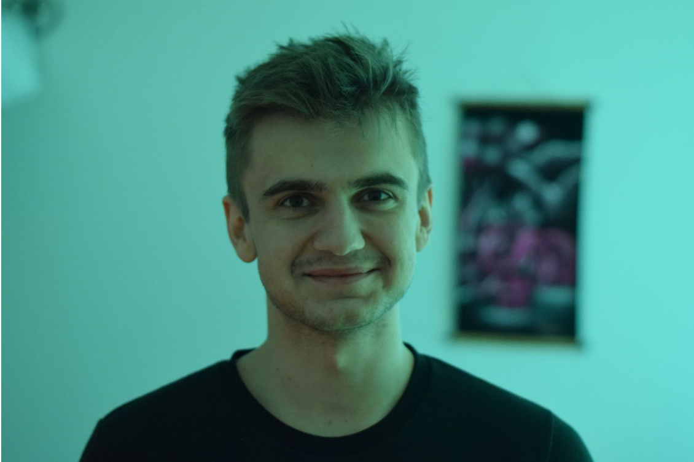

# Medlemmar (Fess)

Projektarbete på kursen Datorsystem med projektarbete (1DT003) 
(1DT096) våren 2020, Uppsala universitet.

Grupp: Fess

## Benny Lam

Bild | Förnamn | Efternamn | Personnummer | Användarnamn (GitHub)
-----------------------------------------|-----------------------------|-----------|--------------|----------------------
 | [Benny](#benny-lam)| Lam | YYMMDD-XXXX | `bela7171`

### Okänd talang

Klassiskt skolad pianist som spelat sedan barnsben. Förutom etyder och nocturner tycker jag även om att fördriva tiden genom spel, träning och med en bra serie. 

### Starka sidor

Under projektet tror jag att jag kommer ha lättast att bidra med:

- planering
- samarbete
- ledarskap
- research
- dokumentation
- rapportskrivande
- muntlig presentation
- analys och problemsökning till viss mån

### Personlig utveckling

Under projektet hoppas jag förutom att bli ännu bättre på mina redan starka
sidor även ges möjlighet att utveckla följande färdigheter, till exempel:

- design av ett "öppet" projekt
- programmering utifrån specifikation
- problemlösning och algoritmer
- skriva kod utifrån färdig specifikation
- utveckla nya sätt att hantera ev. problem(kod, tidspress eller annat)

## Daniel Bäckner

Bild | Förnamn | Efternamn | Personnummer | Användarnamn (GitHub)
-----------------------------------------|-----------------------------|-----------|--------------|----------------------
 | [Daniel](#daba6626) | Bäckner | YYMMDD-XXXX | `daba6626`

### Okänd talang

Dömer fotboll och innebandy, har ett intresse för ekonomi och företagande, samt gillar teknik och gaming i massvis av olika former.

### Starka sidor

Under projektet tror jag att jag kommer ha lättast att bidra med:

- analys/specifikation
- planering
- research (söka och sammanställa information)
- dokumentation
- rapportskrivande
- muntlig presentation

### Personlig utveckling

Under projektet hoppas jag förutom att bli ännu bättre på mina redan starka
sidor även ges möjlighet att utveckla följande färdigheter, till exempel:

- Genomföra arbetsprocessen med en bra slutprodukt
- problemlösning och algoritmer
- skriva kod utifrån färdig specifikation

## Fabian Haglund

Bild | Förnamn | Efternamn | Personnummer | Användarnamn (GitHub)
-----------------------------------------|-----------------------------|-----------|--------------|----------------------
 | [Fabian](#fabian-haglund) | Haglund | 950211-5778 | `fabianhaglund`

### Okänd talang

Driver tech-bolag, skriver ganska mycket (filosofi, poesi och en del skönlitterärt) samt arbetar lite smått på design av en dagbädd. 

### Starka sidor

Under projektet tror jag att jag kommer ha lättast att bidra med:

Jag har jobbat professionellt med projektledning/produktägarskap inom digital produktutveckling i 3-4 år nu så med det i ryggen bidrar jag nog enklast på den fronten:

- allmän projektledning (planering, koordination, uppföljning etc.)
- organisationsförmåga
- kommunikation
- ledarskap 
- idéutveckling
- problemmodellering
- rapportskrivande 

### Personlig utveckling

Under detta projektet vill jag gärna fokusera på att utveckla mina programmeringsfärdigheter, särskilt med inriktning på: 

- tänka kring systemarkitektur
- hantera asynkront dataflöde  
- jobba med databas och server i "molnet" 

## Gholam Mohammadi

Bild | Förnamn | Efternamn | Personnummer | Användarnamn (GitHub)
-----------------------------------------|-----------------------------|-----------|--------------|----------------------
 | [Gholam](#gholam-mohammadi) | Mohammadi | 950902-7539 | `gholam95`

### Okänd talang

-Gillar att titta på football och läsa att möjlig från bok till vetenskaplig artikler.

### Starka sidor

Under projektet tror jag att jag kommer ha lättast att bidra med:

- analys/design/specifikation
- planering
- samarbete
- ledarskap
- research
- dokumentation
- muntlig presentation

### Personlig utveckling

- analys/design/specifikation
- problemlösning och algoritmer
- skriva kod utifrån färdig specifikation
- planering
- samarbete
- ledarskap
- research
- dokumentation
- rapportskrivande
- Jobba på ett större projekt under längre tid
- Arbete distans i en grupp

## Jonathan Tadese

Bild | Förnamn | Efternamn | Personnummer | Användarnamn (GitHub)
-----------------------------------------|-----------------------------|-----------|--------------|----------------------
 | [Jonathan](#jonathan-tadese) | Tadese | 990305-9310 | `jontad`

### Okänd talang

Gillar basket, spel, mat, att lyssna på musik och podcasts, och lite allt möjligt.

### Starka sidor

Under projektet tror jag att jag kommer ha lättast att bidra med:

- Analys/Design
- Planering
- Samarbete
- Research (söka och sammanställa information)
- Dokumentation
- Rapportskrivande

### Personlig utveckling

Under projektet hoppas jag förutom att bli ännu bättre på mina redan starka
sidor även ges möjlighet att utveckla följande färdigheter, till exempel:

- Algoritmer
- Skriva kod utifrån färdig specifikation
- Ledarskap
- Muntlig presentation
- Distansarbete

## Vladislav Bertilsson

Bild | Förnamn | Efternamn | Personnummer | Användarnamn (GitHub)
-----------------------------------------|-----------------------------|-----------|--------------|----------------------
 | [Vladislav](#Vladislav-Bertilsson) | Bertilsson | 980829-4491 | `Vlad-Ber`

### Okänd talang

Tävla inom e-sport, producera musik, träna, lyssna på podcasts. 

### Starka sidor

Under projektet tror jag att jag kommer ha lättast att bidra med:

- Att ta ansvar för mitt arbete
- Se till att vi kommer närmare vårt mål
- Att effektivesera vårt arbete.
- Problemlösning
- Research
- Datastrukturer/Algoritmer
- Analys/Design
- Lära sig nytt snabbt

### Personlig utveckling

Under projektet hoppas jag förutom att bli ännu bättre på mina redan starka
sidor även ges möjlighet att utveckla följande färdigheter, till exempel:

- Arbeta med kod annan skrivit
- Kommunikation
- Github
- Samarbete i ett större projekt
- Gå från en öppen idé till slutprodukt
- Arbete på distans

